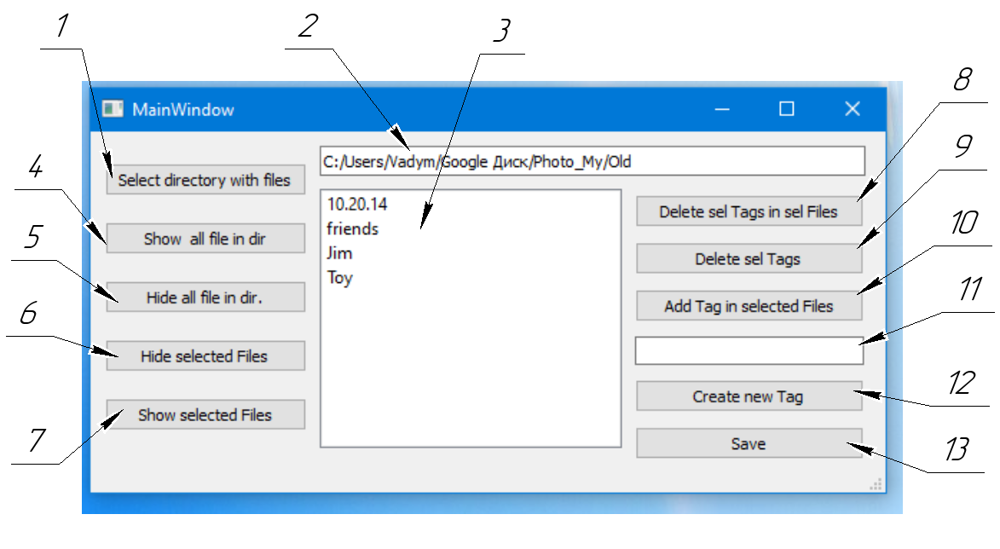

Данное приложение не является законченным, работает в тестовом режиме. 
Файловый сортировщик позволяет проставить теги любым файлам и в дальнейшем сортировать (скрывать/отображать в папке) файлы по данным тегам, наподобие фильтров в онлайн-магазинах. Хотя приложение в первую очередь ориентировано на изображение, оно поддерживает большинство других форматов файлов (игнорируя папки). 

Все 3 файла (lib, FileSorted_1.3_des.ui, FileSorted_1.3.py) должны находится в одной папке. 

Запускаем пайтон-файл. 

Выбираем папку с файлами (1) - появляется окно проводника в котором мы обычным путём выбираем папку с расположением необходимых картинок. В строке (2) - отобразится полный адрес выбранной папки. В столбце (3) появляются все существующие теги из выбранной папки (если они ранее были назначены).
Далее программа условно разбита на 2 осн. модуля. а) Сортировка (левая часть интерфейса) б) работа с Тегами (правая часть интерфейса)

    а) сортировка:
Команды (4) и (5) общие - скрыть/отобразить все файлы в данной папке. 
В столбце (3) отмечаем необходимые Теги (1 или несколько). Далее выбираем одну из команд (6) или (7). (6) - делает невидимыми в папке все не выбранные изображения (соответственно у нас остаётся папка только с отфильтрованными изображениями). (7) - всё наоборот. 

    б) Работа с Тегами:
(8) - удаляет выбранные теги из выбранных файлов (открывается диалоговое окно для выбора файлов).
(9) - удаляет выбранные теги из всех изображений в выбранной папке, а также из листа тегов. 
(10) Добавляет теги к выбранным файлам (открывается диалоговое окно для выбора файлов.
Создание новых тегов:
в строке (11) вводим название нового тега, нажимаем кнопку (12) - и данный тег создаётся, появляется в колонке (3), после чего его можно назначить любым изображениям. 
(13) - сохраняет все манипуляции с тегами. 
